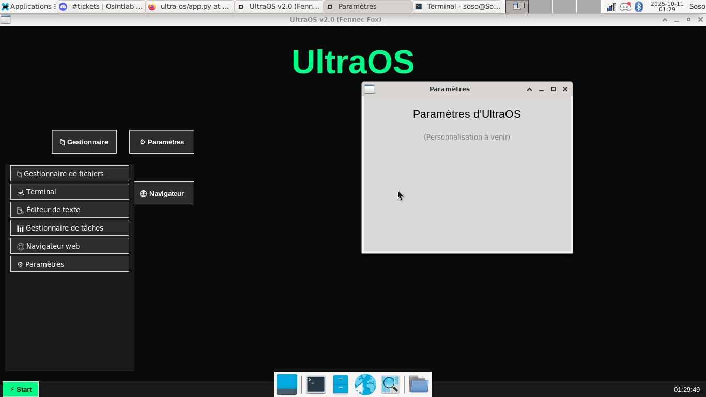

# UltraOS
OS complet fait en python pour tout les systemes!

## Screenshots:
**Version 1.0 Zen (plus maintenue/supprimer des fichiers)**:

**Version 2.0 Fennec Fox (actuel)**:

**Version 2.023 Sunsettling (beta preview)**:

## Guides
- EN: [UltraOS - Gitbook](https://sosos-softwares-and-games.gitbook.io/ultraos)
- FR: [UltraOS - Docs](https://ultraos.vercel.app)

## Installation
- Windows: Releases --> Fennec Fox (2.0) --> app.py
- (1) Linux: Releases --> Fennec Fox (2.0) --> app.py
- (2) Linux: Téléchargez l'app.py, l'icon.png et le ultraos.desktop et les mettre sur votre desktop puis lancez ultraos.desktop

## Dépendances:
- Tkinter
- PSUtil
- **__Pillow et CustomTkinter pour la version Sunsettling__**
- ***__NEW__*** TKHTMLVIEW pour le support web partial (Beta seulement)

## Informations
UltraOS est un système d'éxploitation écrit en Python en
phase de dévelopement. Il contient actuellement:
- Un Gestionnaire de fichiers
- Un Gestionnaire de taches
- Un Terminal
- Des paramètre (en cours de dévelopement)

Il utilise tkinter pour son core/kernel et psutil pour gestion des taches.

## Releases
**Version Actuel: 2.0 Fennec Fox (peut etre télécharger depuis les releases)**

**Version Beta Preview: 2.023 Sunsettling (peut etre télécharger depuis l'app.py dans les fichiers sources)**

**Version Unstable: 3.234 Nova (trop instable pour etre remis au public actuellement)**
---
## OpeNUltra
UltraoOS est open source!
